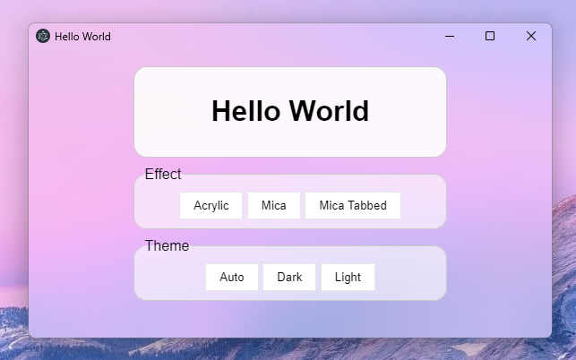
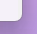
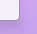
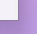
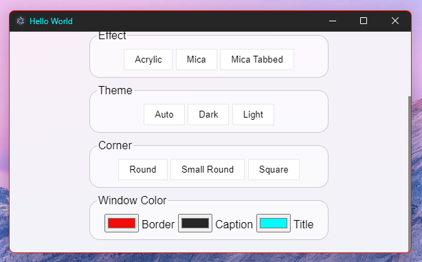

<h1 align=center>Mica Electron</h1>
<div align=center>

</div>
<br>

<details>
  <summary>Exemple of effects</summary>
  <div align=center>
	
	
	 
  </div> 
</details><br> 

<b>Mica Electron</b> is a tool to add mica effect on electron app.<br>
This is created by <a href="https://www.youtube.com/gregvido">GregVido</a>.
If you want use npm, click <a href="https://www.npmjs.com/package/mica-electron">here</a>.

<h2>Usage</h2>

The HWND can be recover with this ligne :
```js
const HWND = win.getNativeWindowHandle()["readInt32LE"]();
```
<details>
  <summary>PARAMS Object</summary>
  The params is a number, you can has an object to help you:

```js
    const PARAMS = {
        BACKGROUND: {
            AUTO: 0,
            NONE: 1,
            ACRYLIC: 3,         // Acrylic
            MICA: 2,            // Mica
            TABBED_MICA: 4      // Mica tabbed
        },
        CORNER: 5,
        BORDER_COLOR: 6,
        CAPTION_COLOR: 7,
        TEXT_COLOR: 8,
        FRAME: 9
    }
```
</details>

<details>
  <summary>VALUE Object</summary>
The value is a string, you can has an object to help you:

```js
const VALUE = {
    THEME: {
        AUTO: 0,	// select theme by the windows theme
        DARK: 1,	// select the dark theme
        LIGHT: 2,	// select the white theme
    },
    CORNER: {
        DEFAULT: 0,
        DONOTROUND: 1,
        ROUND: 2,
        ROUNDSMALL: 3
    },
    COLOR: {
        RED: 0x000000FF,
        GREEN: 0x0000FF00,
        BLUE: 0x00FF0000,
        BLACK: 0x00000000,
        WHITE: 0x00FFFFFF,
        FROM_RGB: (r, g, b) => {
            return r + (g << 8) + (b << 16);
        }
    },
    FALSE: 0,
    TRUE: 1
}
```
</details><br>

You can apply effect with this code :
```js
const { executeDwm, redraw } = require('./source/build/Release/micaElectron');
// the redraw function is for removing the frame

executeDwm(HWND, params, value);
```

<details>
  <summary>Change radius</summary>
    You can change corner radius :

```js
executeDwm(HWND, PARAMS.CORNER, VALUE.CORNER.ROUND);		// Rounded
executeDwm(HWND, PARAMS.CORNER, VALUE.CORNER.ROUNDSMALL);	// Small rounded
executeDwm(HWND, PARAMS.CORNER, VALUE.CORNER.DONOTROUND);	// Square
```
<div align=center>


 
</div>
</details>

<details>
  <summary>Change window colors</summary>
    You can change window colors :

```js
executeDwm(HWND, PARAMS.BORDER_COLOR, VALUE.COLOR.FROM_RGB(244, 11, 11));	// Border color
executeDwm(HWND, PARAMS.CAPTION_COLOR, VALUE.COLOR.FROM_RGB(38, 38, 38));	// Background titlebar color
executeDwm(HWND, PARAMS.TEXT_COLOR, VALUE.COLOR.WHITE);			// Title text color
```
<div align=center>

</div>
</details><br>

<h3>How to remove the frame ?</h3>

You can remove the frame with the redraw function with this code:

```js
function removeFrame(window) {
    const HWND = window.getNativeWindowHandle()["readInt32LE"]();

    const bounds = window.getBounds();

    window.hide();

    redraw(HWND, bounds.x, bounds.y, bounds.width, bounds.height);

    window.show();
}

const win = new BrowserWindow({
    width: 600,
    height: 360,
    backgroundColor: '#000000ff', // Transparent background
    frame: false, // important
    ...
});

let frameRemoved = false;

win.on('show', () => {
  executeDwm(HWND, params, value);
  if (!frameRemoved) {
    frameRemoved = true;
    removeFrame(win);
  }
});

win.on('resize', () => {
  setTimeout(() => executeDwm(HWND, params, value), 60); // refresh effect
});
```

## FAQ
<details>
  <summary>Error: '...\micaElectron.node' was compiled against a different Node.js version using ...</summary>
  If you are an error of nodejs version, use electron-packager to rebuild the project with the good version.

  ```bash
  $ npm install electron
  $ npm install electron-rebuild
  $ .\node_modules\.bin\electron-rebuild
  ```
</details>
<details>
  <summary>Build for 32 bits ?</summary>

  If you want use `mica-electron` with 32 bits electron app, rebuild C++ script

``` bash
$ node-gyp rebuild --arch=ia32
```
</details>
<br>

## Awesome applications using Mica-Electron

- [MicaDiscord](https://www.micadiscord.com/) by GregVido and Arbitro
- [Cider](https://github.com/ciderapp/Cider)
- [Fluent Browser](https://github.com/ThePiGuy3141/fluent-browser) by <a href="https://github.com/ThePiGuy3141">ThePiGuy3141</a>
- [Mica-Snap](https://github.com/GregVido/Mica-Snap) by GregVido