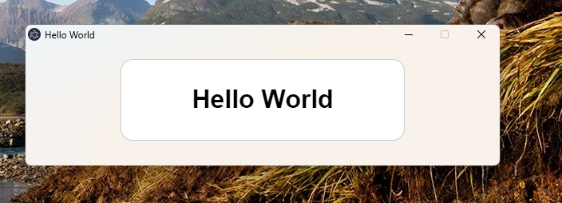
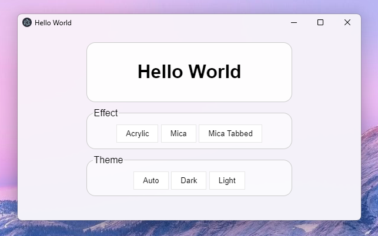
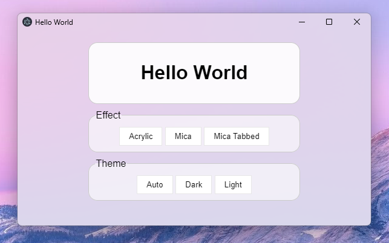

<h1>Mica Electron</h1>


<details>
  <summary>Exemple d'effets</summary>
  <center>
	
	
	 
  </center> 
</details><br> 

<b>Mica Electron</b> is a tool to add mica effect on electron app.<br>
This is created by <a href="https://www.youtube.com/gregvido">GregVido</a>.
If you want use npm, click <a href="https://www.npmjs.com/package/mica-electron">here</a>.

<h2>How use ?</h2>
To use <b>Mica Electron</b>, you must execute the file <a href="dwm_exec.exe">dwm_exec.exe</a> with threes arguments :<br>

- HWND : the window to apply effect
- EFFECT : the type of transparency
- THEME : the color of effect

The HWND can be recover with this ligne :
```js
const HWND = win.getNativeWindowHandle()["readInt32LE"]();
```

The effect is a number, you can has an object to help you:
```js
const TRANSPARENT = {
	AUTO: 0,
	NONE: 1,
	ACRYLIC: 3,		// acrylic
	MICA: 2,		// mica
	MICA_TABBED: 4	// mica tabbed
}
```

The theme is a string, you can has an object to help you:
```js
const THEME = {
    AUTO: 'auto',	// select theme by the windows theme
    DARK: 'dark',	// select the dark theme
    LIGHT: 'light',	// select the white theme
}
```

You can execute the file with this code :
```js
const execFile = require("child_process").execFileSync;

execFile('dwm_exec.exe', [HWND, TRANSPARENT.DWMSBT_MAINWINDOW, THEME.AUTO]);
```

<h2>Update 1.0.6</h2>
- Fix exemple

<h2>Update 1.0.5</h2>
- Fix frameless (you can now resize the window)

<h2>Update 1.0.4</h2>

- Fix dll missing
- Fix windows 11 old version

<h2>Update 1.0.3</h2>

- Add theme in arguments

<h2>Update 1.0.2</h2>

- Enable auto dark mod
- Detect if operating system is windows 11

## Awesome applications using Mica-Electron

- [MicaDiscord](https://www.micadiscord.com/) by GregVido and Arbitro